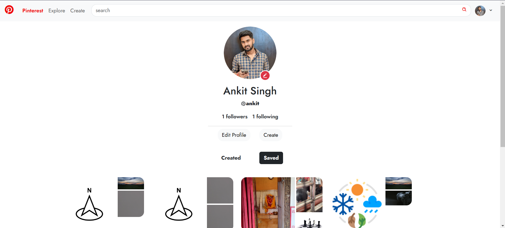
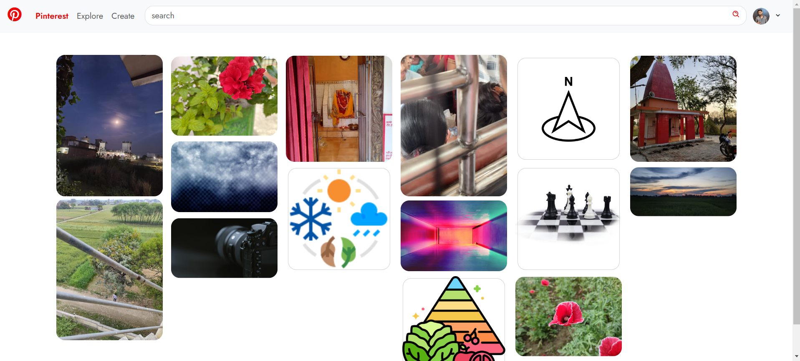
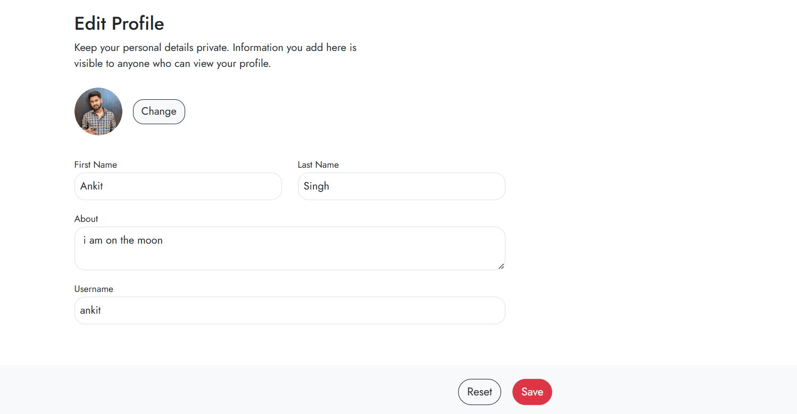
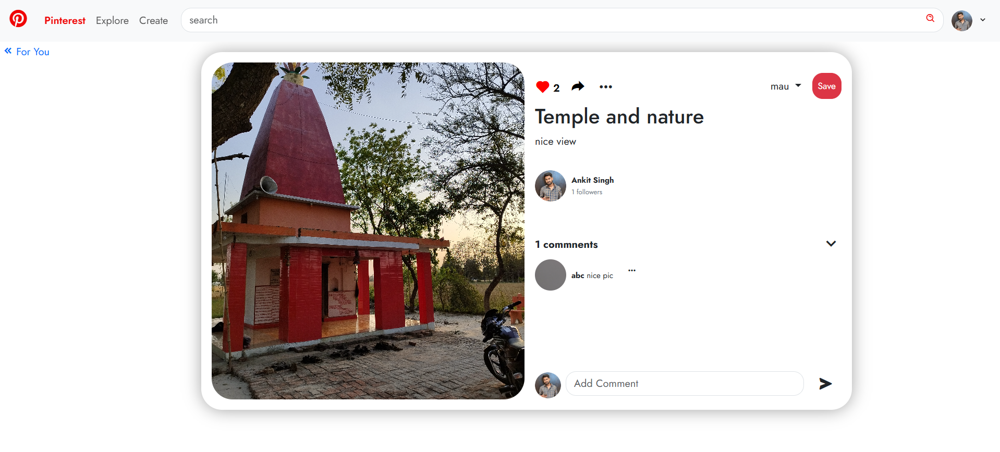

# 📌 Pinterest Clone

Welcome to the **Pinterest Clone** project! This application mimics the functionality of Pinterest, allowing users to discover, save, and share visual content through boards and interactive features.

## 🚀 Features

- **User Accounts**: Create and update user accounts.
- **Follow Other Users**: Connect with friends and creators by following their profiles.
- **Like and Comment**: Engage with posts by liking and commenting on them.
- **Comment On/Off**: Control whether comments are displayed on your posts.
- **Boards for Saved Content**: Organize saved posts into custom boards for easy access.

## ⚙️ Technologies Used

- **Frontend**: HTML, CSS, JavaScript
- **Backend**: Node.js, Express
- **Database**: MongoDB
- **Deployment**: Render (or your preferred hosting service)

## 🖼️ Screenshots

*User profile showing account information and followed users.*

*Home feed displaying pins from followed users and trending content.*

*Edit Profile info for updating picture and username.*

*Post interaction view showing comments, likes, and share options.*

## 🕹️ How to Use

1. **Visit the Site**: Go to the [Live Demo](https://pinterest-y4gw.onrender.com/).
2. **Create an Account**: Sign up to start discovering and saving content.
3. **Explore Content**: Browse the home feed for inspiration.
4. **Engage with Posts**: Like, comment, and save posts to your boards.
5. **Manage Your Boards**: Organize your saved content into specific boards.

## 📜 License

This project is licensed under the MIT License - see the [LICENSE](LICENSE) file for details.

## 🙏 Acknowledgements

- Inspired by [Pinterest](https://www.pinterest.com/) for the concept.
- Technologies and libraries used for building the application.

## 📫 Contact

For any questions or feedback, feel free to reach out to me at:  
**Email**: singhelboyankit@gmail.com  
**LinkedIn**: [Ankit Singhel](https://www.linkedin.com/in/ankitsinghel/)
